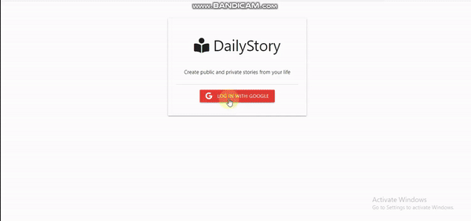

# DailyStory App

StoryBooks is a platform designed for users to create and share stories, utilizing **Node.js, Express, MongoDB, Passport** with a **Google OAuth strategy**, and more. It offers a seamless experience for both content creators and readers.

## Introduction

The Daily Story app provides a user-friendly interface for creating, managing, and sharing stories. It incorporates various technologies to ensure smooth functionality and robust security measures.

## Features

- **User Authentication**: Utilizing Google OAuth authentication strategy with Passport.js, ensuring secure and hassle-free login process.
- **Database Management**: MongoDB is used as the database to efficiently store user data, stories, and session information.
- **Story Creation and Editing**: Users can create, edit, and delete their stories, providing flexibility in content management.
- **Interactive Dashboard**: A personalized dashboard displays user stories, facilitating easy navigation and management.
- **Public Stories**: Users can choose to make their stories public, allowing others to read and enjoy their content.
- **Formatted Text**: Integration of helpers for formatting text, handling dates, and managing story content for enhanced readability.
- **Session Management**: Implementation of session management techniques, including storing sessions in the database for improved security.

## Project Video

-------------------------------------------------------------
This project is a practice exercise where I developed the backend of the StoryBooks app. The frontend components were sourced from the internet.
